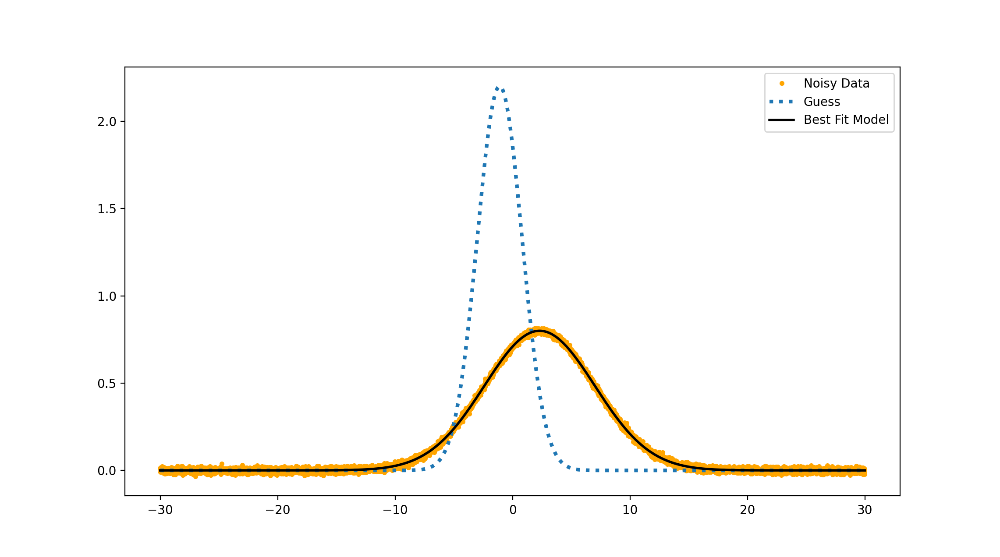

.. Nelder Mead documentation master file, created by
   sphinx-quickstart on Sat May 30 15:42:33 2020.
   You can adapt this file completely to your liking, but it should at least
   contain the root `toctree` directive.

Tutorials
=========

Here we demonstrate how to use the Nelder-Mead optimization routine. Internally, the solver utilizes numpy to expedite the optimization algorithm, as well a a container for optimiztion parameters (LINK) to ensure interation with the user is straightforward. Target functions may use the high level parameters module, or rely only on numpy arrays for parametrizing the model.

Example 1: Fitting a Gaussian (Parameter based)
+++++++++++++++++++++++++++++++++++++++++++++++

.. literalinclude:: ../examples/gauss_fit_example_numpy.py
    :language: python

Example 2: Fitting a Gaussian (Numpy based)
+++++++++++++++++++++++++++++++++++++++++++

.. literalinclude:: ../examples/gauss_fit_example_numpy.py
    :language: python

The result ...

Indices and tables
==================

* :ref:`genindex`
* :ref:`modindex`
* :ref:`search`
